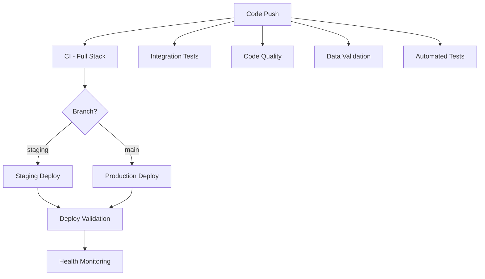

# GitHub Actions Workflows

This directory contains all GitHub Actions workflows for automated CI/CD pipeline.

## 📁 Workflow Files

| Workflow | File | Purpose | Trigger |
|----------|------|---------|---------|
| **CI - Full Stack** | `ci-full-stack.yml` | Build & test all services | Push/PR to develop, staging, main |
| **Integration Tests** | `integration-tests.yml` | Full stack integration testing | Push/PR to develop, staging, main |
| **Code Quality** | `code-quality.yml` | Code quality & security checks | Push/PR + Weekly |
| **Staging Deploy** | `staging.yml` | Deploy to staging environment | Push to staging/develop |
| **Production Deploy** | `production.yml` | Deploy to production | Push to main + Manual |
| **Deploy Validation** | `deploy-validation.yml` | Validate deployments | After staging/production deploy |
| **Health Monitoring** | `health-monitoring.yml` | Monitor system health | Every 30 minutes |
| **Data Validation** | `data-validation.yml` | Validate data integrity | Push/PR to develop, staging, main |
| **Automated Tests** | `tests.yml` | Run test suites | Push/PR to develop, staging, main |

## 🔄 Workflow Dependencies



## 🎯 Workflow Execution Matrix

| Event | Workflows Triggered |
|-------|-------------------|
| **Push to feature branch** | CI, Tests, Code Quality |
| **Push to develop** | CI, Tests, Code Quality, Integration, Data Validation |
| **Push to staging** | CI, Tests, Code Quality, Integration, Data Validation, Staging Deploy |
| **Push to main** | CI, Tests, Code Quality, Integration, Data Validation, Production Deploy |
| **Pull Request** | CI, Tests, Code Quality, Integration, Dependency Review |
| **Schedule (30min)** | Health Monitoring |
| **Schedule (Weekly)** | Code Quality, Security Audit |

## 🚀 Quick Start

### Running Workflows Manually

```bash
# Staging deployment
gh workflow run staging.yml

# Production deployment with version
gh workflow run production.yml -f version=v1.0.0

# Deploy validation
gh workflow run deploy-validation.yml -f environment=staging

# Health monitoring
gh workflow run health-monitoring.yml -f environment=both
```

### Viewing Workflow Results

```bash
# List all workflow runs
gh run list

# Watch specific workflow
gh run watch

# View logs
gh run view <run-id> --log

# View failed jobs only
gh run view <run-id> --log-failed
```

## 📊 Status Badges

Add these to your README:

```markdown


```

## 🔐 Required Secrets

Configure these in: `Settings → Secrets and variables → Actions`

### Docker Registry
- `DOCKER_REGISTRY`
- `DOCKER_USERNAME`
- `DOCKER_PASSWORD`

### Staging Environment
- `STAGING_URL`
- `STAGING_API_BASE_URL`
- `STAGING_WS_URL`

### Production Environment
- `PRODUCTION_URL`
- `PRODUCTION_API_BASE_URL`
- `PRODUCTION_WS_URL`

## 📝 Modifying Workflows

### Best Practices
1. Test changes on feature branch first
2. Use `workflow_dispatch` for manual testing
3. Add appropriate `continue-on-error` for non-critical steps
4. Include detailed logging
5. Set appropriate timeouts
6. Use caching to speed up builds

### Testing Workflow Changes
```bash
# Push to feature branch
git checkout -b test-workflow-update
# Modify .github/workflows/*.yml
git add .github/workflows/
git commit -m "test: update workflow"
git push origin test-workflow-update

# Check workflow run
gh run list --branch test-workflow-update
```

## 🐛 Troubleshooting

### Common Issues

**Workflow not triggering**
- Check branch filters in `on:` section
- Verify file is in `.github/workflows/`
- Check file syntax (YAML)

**Build failures**
- Review logs: `gh run view --log`
- Check dependencies versions
- Verify Docker build context
- Check environment variables

**Deployment failures**
- Verify secrets are configured
- Check server connectivity
- Review deployment scripts
- Validate Docker images

**Test failures**
- Run tests locally first
- Check database connectivity
- Verify test data setup
- Review environment setup

## 📚 Additional Resources

- [GitHub Actions Documentation](https://docs.github.com/en/actions)
- [Workflow Syntax](https://docs.github.com/en/actions/using-workflows/workflow-syntax-for-github-actions)
- [Security Best Practices](https://docs.github.com/en/actions/security-guides/security-hardening-for-github-actions)
- [CI/CD Guide](../docs/CI-CD-GUIDE.md)

## 🔄 Maintenance

### Weekly Tasks
- Review failed workflow runs
- Check for outdated dependencies
- Update action versions
- Review security audit results

### Monthly Tasks
- Update Node.js version if needed
- Review and optimize workflow performance
- Update documentation
- Review and clean up old workflow runs

---

**Last Updated:** 2024-12-20  
**Maintained by:** DevOps Team
